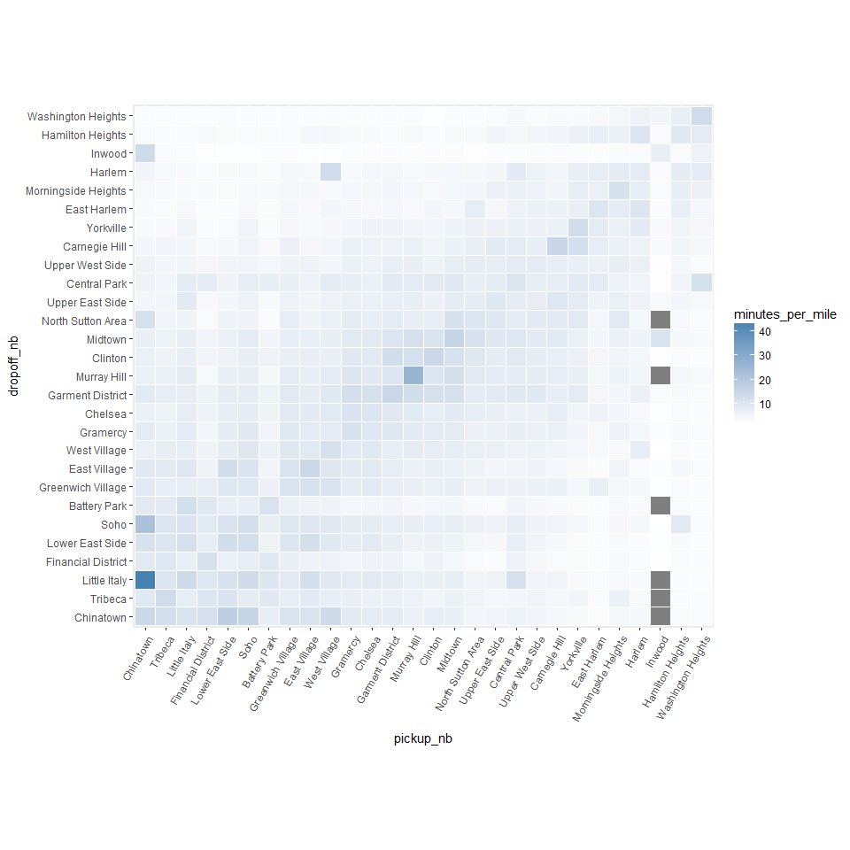
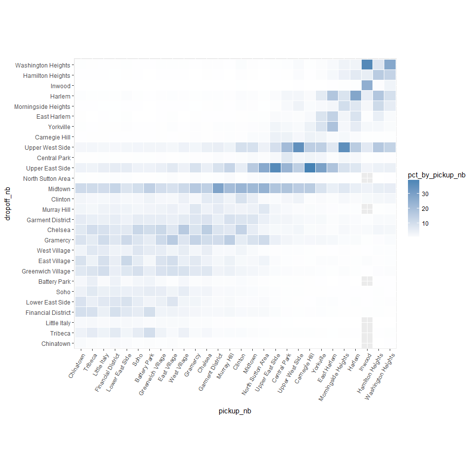

Running sanity checks
================
Seth Mottaghinejad
2017-01-27

Running sanity checks
=====================

In addition to asking whether the data makes logical sense, it's often a good idea to also check whether the data makes business sense or practical sense. Doing so can help us catch certain errors in the data such as data being mislabeled or attributed to the wrong set of features. If unaccounted, such soft errors can have a profound impact on the analysis.

Learning objectives
-------------------

After reading this chapter, we will understand how to - run basic tabulations and summaries on the data - take the return objects from `RevoScaleR` summary functions for further processing by R functions for plotting and more - visualize the distribution of a column with `rxHistogram` - take a random sample of the large data and use it as a way to examine outliers

Examining neighborhoods
-----------------------

By passing `~ .` as the formula to `rxSummary`, we can summarize all the columns in the data.

``` r
system.time(rxs_all <- rxSummary(~., nyc_xdf))
```

    ## Rows Read: 500000, Total Rows Processed: 500000, Total Chunk Time: 0.559 seconds
    ## Rows Read: 500000, Total Rows Processed: 1000000, Total Chunk Time: 0.543 seconds
    ## Rows Read: 500000, Total Rows Processed: 1500000, Total Chunk Time: 0.610 seconds
    ## Rows Read: 500000, Total Rows Processed: 2000000, Total Chunk Time: 0.637 seconds
    ## Rows Read: 500000, Total Rows Processed: 2500000, Total Chunk Time: 0.640 seconds
    ## Rows Read: 500000, Total Rows Processed: 3000000, Total Chunk Time: 0.632 seconds
    ## Rows Read: 500000, Total Rows Processed: 3500000, Total Chunk Time: 0.643 seconds
    ## Rows Read: 500000, Total Rows Processed: 4000000, Total Chunk Time: 0.670 seconds
    ## Rows Read: 500000, Total Rows Processed: 4500000, Total Chunk Time: 0.608 seconds
    ## Rows Read: 500000, Total Rows Processed: 5000000, Total Chunk Time: 0.636 seconds
    ## Rows Read: 500000, Total Rows Processed: 5500000, Total Chunk Time: 0.625 seconds
    ## Rows Read: 500000, Total Rows Processed: 6000000, Total Chunk Time: 0.602 seconds 
    ## Computation time: 7.801 seconds.

    ##    user  system elapsed 
    ##    0.03    0.00    7.83

For example, the numeric summaries for the relevant columns in the data are stored in `rxs_all` under the element called `sDataFrame`.

``` r
head(rxs_all$sDataFrame)
```

    ##               Name       Mean      StdDev       Min          Max ValidObs
    ## 1  pickup_datetime         NA          NA        NA           NA    0e+00
    ## 2 dropoff_datetime         NA          NA        NA           NA    0e+00
    ## 3  passenger_count   1.660809    1.310673    0.0000 9.000000e+00    6e+06
    ## 4    trip_distance   3.805193 1131.696858    0.0000 1.674368e+06    6e+06
    ## 5 pickup_longitude -72.917826    8.773957 -121.9337 0.000000e+00    6e+06
    ## 6  pickup_latitude  40.169355    4.833384    0.0000 5.726928e+01    6e+06
    ##   MissingObs
    ## 1          0
    ## 2          0
    ## 3          0
    ## 4          0
    ## 5          0
    ## 6          0

If we wanted one-way tables showing counts of levels for each `factor` column in the data, we can refer to `rxs_all` to obtain that, but if we need to get two-way tables showing counts of combinations of certain `factor` columns with others we need to pass the correct formula to the summary function. Here we use `rxCrossTabs` to get the number of trips from one neighborhood going into another.

``` r
nhoods_by_borough <- rxCrossTabs(~pickup_nhood:pickup_borough, nyc_xdf)
```

    ## Rows Read: 500000, Total Rows Processed: 500000, Total Chunk Time: 0.016 seconds
    ## Rows Read: 500000, Total Rows Processed: 1000000, Total Chunk Time: 0.017 seconds
    ## Rows Read: 500000, Total Rows Processed: 1500000, Total Chunk Time: 0.016 seconds
    ## Rows Read: 500000, Total Rows Processed: 2000000, Total Chunk Time: 0.015 seconds
    ## Rows Read: 500000, Total Rows Processed: 2500000, Total Chunk Time: 0.018 seconds
    ## Rows Read: 500000, Total Rows Processed: 3000000, Total Chunk Time: 0.016 seconds
    ## Rows Read: 500000, Total Rows Processed: 3500000, Total Chunk Time: 0.018 seconds
    ## Rows Read: 500000, Total Rows Processed: 4000000, Total Chunk Time: 0.015 seconds
    ## Rows Read: 500000, Total Rows Processed: 4500000, Total Chunk Time: 0.016 seconds
    ## Rows Read: 500000, Total Rows Processed: 5000000, Total Chunk Time: 0.016 seconds
    ## Rows Read: 500000, Total Rows Processed: 5500000, Total Chunk Time: 0.018 seconds
    ## Rows Read: 500000, Total Rows Processed: 6000000, Total Chunk Time: 0.018 seconds 
    ## Computation time: 0.208 seconds.

``` r
nhoods_by_borough <- nhoods_by_borough$counts[[1]]
nhoods_by_borough <- as.data.frame(nhoods_by_borough)
# get the neighborhoods by borough
lnbs <- lapply(names(nhoods_by_borough), function(vv) subset(nhoods_by_borough, nhoods_by_borough[, 
    vv] > 0, select = vv, drop = FALSE))
lapply(lnbs, head)
```

    ## [[1]]
    ## [1] Albany
    ## <0 rows> (or 0-length row.names)
    ## 
    ## [[2]]
    ## [1] Buffalo
    ## <0 rows> (or 0-length row.names)
    ## 
    ## [[3]]
    ##              New York City-Bronx
    ## Baychester                    14
    ## Bedford Park                 134
    ## City Island                    6
    ## Country Club                  32
    ## Eastchester                    8
    ## Fordham                      117
    ## 
    ## [[4]]
    ##                    New York City-Brooklyn
    ## Bay Ridge                             321
    ## Bedford-Stuyvesant                   4759
    ## Bensonhurst                           115
    ## Boerum Hill                          6593
    ## Borough Park                          759
    ## Brownsville                           239
    ## 
    ## [[5]]
    ##               New York City-Manhattan
    ## Battery Park                    55599
    ## Carnegie Hill                   69672
    ## Central Park                    80785
    ## Chelsea                        397915
    ## Chinatown                       18155
    ## Clinton                        177426
    ## 
    ## [[6]]
    ##                          New York City-Queens
    ## Astoria-Long Island City                26079
    ## Auburndale                                 47
    ## Clearview                                  14
    ## College Point                               1
    ## Corona                                    136
    ## Douglastown-Little Neck                    81
    ## 
    ## [[7]]
    ##                             New York City-Staten Island
    ## Annandale                                             1
    ## Ardon Heights                                         4
    ## Bloomfield-Chelsea-Travis                             2
    ## Charlestown-Richmond Valley                           2
    ## Clifton                                              46
    ## Howland Hook                                          1
    ## 
    ## [[8]]
    ## [1] Rochester
    ## <0 rows> (or 0-length row.names)
    ## 
    ## [[9]]
    ## [1] Syracuse
    ## <0 rows> (or 0-length row.names)

Looking at Manhattan only
-------------------------

Since the lion's share of taxi trips take place in Manhattan, we focus our attention to Manhattan only and ignore the other four boroughs. For that purpose, we create two new columns called `pickup_nb` and `dropoff_nb` based on the original columns `pickup_nhood` and `dropoff_nhood` except that their factor levels are limited to Manhattan neighborhoods (any other factor level will be replaced with an NA). It is important to do so, because otherwise neighborhoods outside of Manhattan will show up in any modeling or summary function involving those columns.

``` r
manhattan_nhoods <- as.character(mht_shapefile@data$NAME)
refactor_columns <- function(data) {
    data$pickup_nb = factor(data$pickup_nhood, levels = nhoods_levels)
    data$dropoff_nb = factor(data$dropoff_nhood, levels = nhoods_levels)
    data
}
rxDataStep(nyc_xdf, nyc_xdf, transformFunc = refactor_columns, transformObjects = list(nhoods_levels = manhattan_nhoods), 
    overwrite = TRUE)
```

    ## Rows Read: 500000, Total Rows Processed: 500000, Total Chunk Time: 6.009 secondsRows Read: 500000, Total Rows Processed: 1000000, Total Chunk Time: 5.267 secondsRows Read: 500000, Total Rows Processed: 1500000, Total Chunk Time: 5.643 secondsRows Read: 500000, Total Rows Processed: 2000000, Total Chunk Time: 5.656 secondsRows Read: 500000, Total Rows Processed: 2500000, Total Chunk Time: 6.193 secondsRows Read: 500000, Total Rows Processed: 3000000, Total Chunk Time: 5.878 secondsRows Read: 500000, Total Rows Processed: 3500000, Total Chunk Time: 4.776 secondsRows Read: 500000, Total Rows Processed: 4000000, Total Chunk Time: 5.262 secondsRows Read: 500000, Total Rows Processed: 4500000, Total Chunk Time: 6.134 secondsRows Read: 500000, Total Rows Processed: 5000000, Total Chunk Time: 4.809 secondsRows Read: 500000, Total Rows Processed: 5500000, Total Chunk Time: 5.022 secondsRows Read: 500000, Total Rows Processed: 6000000, Total Chunk Time: 4.562 seconds

``` r
rxs_pickdrop <- rxSummary(~pickup_nb:dropoff_nb, nyc_xdf)
```

    ## Rows Read: 500000, Total Rows Processed: 500000, Total Chunk Time: 0.014 seconds
    ## Rows Read: 500000, Total Rows Processed: 1000000, Total Chunk Time: 0.022 seconds
    ## Rows Read: 500000, Total Rows Processed: 1500000, Total Chunk Time: 0.023 seconds
    ## Rows Read: 500000, Total Rows Processed: 2000000, Total Chunk Time: 0.025 seconds
    ## Rows Read: 500000, Total Rows Processed: 2500000, Total Chunk Time: 0.028 seconds
    ## Rows Read: 500000, Total Rows Processed: 3000000, Total Chunk Time: 0.025 seconds
    ## Rows Read: 500000, Total Rows Processed: 3500000, Total Chunk Time: 0.027 seconds
    ## Rows Read: 500000, Total Rows Processed: 4000000, Total Chunk Time: 0.020 seconds
    ## Rows Read: 500000, Total Rows Processed: 4500000, Total Chunk Time: 0.024 seconds
    ## Rows Read: 500000, Total Rows Processed: 5000000, Total Chunk Time: 0.028 seconds
    ## Rows Read: 500000, Total Rows Processed: 5500000, Total Chunk Time: 0.031 seconds
    ## Rows Read: 500000, Total Rows Processed: 6000000, Total Chunk Time: 0.026 seconds 
    ## Computation time: 0.319 seconds.

``` r
head(rxs_pickdrop$categorical[[1]])
```

    ##       pickup_nb   dropoff_nb Counts
    ## 1  West Village West Village   7232
    ## 2  East Village West Village   6119
    ## 3  Battery Park West Village   2865
    ## 4 Carnegie Hill West Village    296
    ## 5      Gramercy West Village  11348
    ## 6          Soho West Village   7880

Examining trip distance
-----------------------

Data is messy and often needs to be cleaned before we can do much with it. Looking at the above summaries and snapshots of the data, we can often tell how the data needs to be cleaned. Here are some suggestions:

-   *Have missing values been properly accounted for?* In flat files missing values have often a different representation as NAs. For example, missing values for character columns can have an empty entry or one with a catchall term such as 'other' or 'n/a', while missing numeric columns can have empty cells, or use NULL or 999. Sometimes, different codes are used to delineate different kinds of missing values (such as data missing because the information is not relevant, or missing because the information was not provided). When recoding missing values to NAs in R, it's important to account for such differences.
-   *Do column types match our expectation?* This is an important consideration, and we dealt with it by explicitly providing column types prior to reading the data. This is the preferred approach since it avoids unnecessary processing, especially the processing that takes place when R reads in a column as a `factor` when it's not needed. Columns with high cardinality that are formatted as `factor` add a lot of overhead to R session. Such columns often don't need to be `factor` and should remain as `integer` or `character` columns. If we don't know ahead of time which columns should be factors and which not, or if we need to clean a column before turning it into a `factor`, then we can suppress the automatic conversion of `character` columns to `factor` columns by setting `stringsAsFactors = FALSE` when we run `rxImport` or specifying all non-numeric columns to be `character` columns.
-   *Are there outliers in the data and do they seem legitimate?* Often, the question of what an outlier is depends on our understanding of the data and tolerance for deviations from the average patterns in the data. In the NYC Taxi dataset, consider the following cases: (1) A passenger might take a cab and use it all day for running multiple errands, asking the driver to wait for him. (2) A passenger might intend to tip 5 dollars and accidentally press 5 twice and tip 55 dollars for a trip that cost 40 dollars. (3) A passenger could get into a argument with a driver and leave without paying. (4) Multi-passenger trips could have one person pay for everyone or each person pay for himself, with some paying with a card and others using cash. (5) A driver can accidentally keep the meter running after dropping someone off. (6) Machine logging errors can result in either no data or wrong data points. In all of these cases, even assuming that we can easily capture the behavior (because some combination of data points falls within unusual ranges) whether or not we consider them *legitimate* still depends on what the purpose of our analysis is. An outlier could be noise to one analysis and a point of interest to another.

Now that we have the data with candidate outliers, we can examine it for certain patterns. For example, we can plot a histogram of `trip_distance` and notice that almost all trips traveled a distance of less than 20 miles, with the great majority going less than 5 miles.

``` r
rxHistogram(~trip_distance, nyc_xdf, startVal = 0, endVal = 25, histType = "Percent", 
    numBreaks = 20)
```

    ## Rows Read: 500000, Total Rows Processed: 500000, Total Chunk Time: 0.175 secondsRows Read: 500000, Total Rows Processed: 1000000, Total Chunk Time: 0.258 secondsRows Read: 500000, Total Rows Processed: 1500000, Total Chunk Time: 0.196 secondsRows Read: 500000, Total Rows Processed: 2000000, Total Chunk Time: 0.286 secondsRows Read: 500000, Total Rows Processed: 2500000, Total Chunk Time: 0.184 secondsRows Read: 500000, Total Rows Processed: 3000000, Total Chunk Time: 0.542 secondsRows Read: 500000, Total Rows Processed: 3500000, Total Chunk Time: 0.176 secondsRows Read: 500000, Total Rows Processed: 4000000, Total Chunk Time: 0.172 secondsRows Read: 500000, Total Rows Processed: 4500000, Total Chunk Time: 0.168 secondsRows Read: 500000, Total Rows Processed: 5000000, Total Chunk Time: 0.170 secondsRows Read: 500000, Total Rows Processed: 5500000, Total Chunk Time: 0.172 secondsRows Read: 500000, Total Rows Processed: 6000000, Total Chunk Time: 0.169 seconds 
    ## Computation time: 2.687 seconds.



There is a second peak around around trips that traveled between 16 and 20, which is worth examining further. We can verify this by looking at which neighborhoods passengers are traveling from and to.

``` r
rxs <- rxSummary(~pickup_nhood:dropoff_nhood, nyc_xdf, rowSelection = (trip_distance > 
    15 & trip_distance < 22))
```

    ## Rows Read: 500000, Total Rows Processed: 500000, Total Chunk Time: 0.058 secondsRows Read: 500000, Total Rows Processed: 1000000, Total Chunk Time: 0.071 secondsRows Read: 500000, Total Rows Processed: 1500000, Total Chunk Time: 0.078 secondsRows Read: 500000, Total Rows Processed: 2000000, Total Chunk Time: 0.063 secondsRows Read: 500000, Total Rows Processed: 2500000, Total Chunk Time: 0.061 secondsRows Read: 500000, Total Rows Processed: 3000000, Total Chunk Time: 0.065 secondsRows Read: 500000, Total Rows Processed: 3500000, Total Chunk Time: 0.090 secondsRows Read: 500000, Total Rows Processed: 4000000, Total Chunk Time: 0.104 secondsRows Read: 500000, Total Rows Processed: 4500000, Total Chunk Time: 0.080 secondsRows Read: 500000, Total Rows Processed: 5000000, Total Chunk Time: 0.076 secondsRows Read: 500000, Total Rows Processed: 5500000, Total Chunk Time: 0.071 secondsRows Read: 500000, Total Rows Processed: 6000000, Total Chunk Time: 0.072 seconds 
    ## Computation time: 1.005 seconds.

``` r
library(dplyr)
head(arrange(rxs$categorical[[1]], desc(Counts)), 10)
```

    ##        pickup_nhood            dropoff_nhood Counts
    ## 1           Midtown Gravesend-Sheepshead Bay    210
    ## 2           Midtown  Douglastown-Little Neck     90
    ## 3   Upper East Side Gravesend-Sheepshead Bay     84
    ## 4           Midtown                  Midtown     83
    ## 5  Garment District Gravesend-Sheepshead Bay     82
    ## 6           Midtown              Bensonhurst     78
    ## 7           Midtown                Bay Ridge     66
    ## 8           Jamaica          Upper West Side     61
    ## 9          Gramercy Gravesend-Sheepshead Bay     60
    ## 10          Chelsea Gravesend-Sheepshead Bay     57

As we can see, `Gravesend-Sheepshead Bay` often appears as a destination, and surprisingly, not as a pickup point. We can also see trips from and to `Jamaica`, which is the neighborhood closest to the JFK airport.

Examining outliers
------------------

Let's see how we could use `RevoScaleR` to examine the data for outliers. Our approach here is rather primitive, but the intent is to show how the use the tools: We use `rxDataStep` and its `rowSelection` argument to extract all the data points that are candidate outliers. By leaving the `outFile` argument we output the resulting dataset into a `data.frame` which we call `odd_trips`. Lastly, if we are too expansive in our outlier selection criteria, then resulting `data.frame` could still have too many rows (which could clog the memory and make it slow to produce plots and other summaries). So we create a new column `u` and populate it with random uniform numbers between 0 and 1, and we add `u < .05` to our `rowSelection` criteria. We can adjust this number to end up with a smaller `data.frame` (threshold closer to 0) or a larger `data.frame` (threshold closer to 1).

``` r
# outFile argument missing means we output to data.frame
odd_trips <- rxDataStep(nyc_xdf, 
  rowSelection = (u < .05 & ( # we can adjust this if the data gets too big
                  (trip_distance > 20 | trip_distance <= 0) |
                  (passenger_count > 5 | passenger_count == 0) |
                  (fare_amount > 1000 | fare_amount <= 0))), 
  transforms = list(u = runif(.rxNumRows)))
```

    ## Rows Read: 500000, Total Rows Processed: 500000, Total Chunk Time: 2.453 secondsRows Read: 500000, Total Rows Processed: 1000000, Total Chunk Time: 3.221 secondsRows Read: 500000, Total Rows Processed: 1500000, Total Chunk Time: 3.283 secondsRows Read: 500000, Total Rows Processed: 2000000, Total Chunk Time: 2.833 secondsRows Read: 500000, Total Rows Processed: 2500000, Total Chunk Time: 3.683 secondsRows Read: 500000, Total Rows Processed: 3000000, Total Chunk Time: 2.577 secondsRows Read: 500000, Total Rows Processed: 3500000, Total Chunk Time: 3.226 secondsRows Read: 500000, Total Rows Processed: 4000000, Total Chunk Time: 4.064 secondsRows Read: 500000, Total Rows Processed: 4500000, Total Chunk Time: 3.582 secondsRows Read: 500000, Total Rows Processed: 5000000, Total Chunk Time: 3.777 secondsRows Read: 500000, Total Rows Processed: 5500000, Total Chunk Time: 5.761 secondsRows Read: 500000, Total Rows Processed: 6000000, Total Chunk Time: 3.103 seconds

``` r
print(dim(odd_trips))
```

    ## [1] 13347    30

Since the dataset with the candidate outliers is a `data.frame`, we can use any R function to examine it. For example, we limit `odd_trips` to cases where a distance of more than 20 miles was traveled, plot a histogram of the fare amount the passenger paid, and color it based on whether the trip took more or less than 10 minutes.

``` r
library(ggplot2)
p <- odd_trips %>% filter(trip_distance > 20) %>% ggplot()
p + geom_histogram(aes(x = fare_amount, fill = trip_duration <= 10 * 60), binwidth = 10) + 
    xlim(0, 500) + coord_fixed(ratio = 0.5)
```


As we can see, the majority of trips that traveled over 50 miles cost nothing or next to nothing, even though most of these trips took 10 minutes or longer. It is unclear whether such trips were the result of machine error human error, but if for example this analysis was targeted at the company that owns the taxis, this finding would warrant more investigation.

### Exercises

Let's re-create the histogram for `trip_distance` using `rxHistogram`:

``` r
rxHistogram(~trip_distance, nyc_xdf, startVal = 0, endVal = 25, histType = "Percent", 
    numBreaks = 20)
```

    ## Rows Read: 500000, Total Rows Processed: 500000, Total Chunk Time: 0.179 secondsRows Read: 500000, Total Rows Processed: 1000000, Total Chunk Time: 0.182 secondsRows Read: 500000, Total Rows Processed: 1500000, Total Chunk Time: 0.257 secondsRows Read: 500000, Total Rows Processed: 2000000, Total Chunk Time: 0.258 secondsRows Read: 500000, Total Rows Processed: 2500000, Total Chunk Time: 0.215 secondsRows Read: 500000, Total Rows Processed: 3000000, Total Chunk Time: 0.194 secondsRows Read: 500000, Total Rows Processed: 3500000, Total Chunk Time: 0.181 secondsRows Read: 500000, Total Rows Processed: 4000000, Total Chunk Time: 0.244 secondsRows Read: 500000, Total Rows Processed: 4500000, Total Chunk Time: 0.179 secondsRows Read: 500000, Total Rows Processed: 5000000, Total Chunk Time: 0.176 secondsRows Read: 500000, Total Rows Processed: 5500000, Total Chunk Time: 0.174 secondsRows Read: 500000, Total Rows Processed: 6000000, Total Chunk Time: 0.177 seconds 
    ## Computation time: 2.435 seconds.


1.  Modify the formula in the line above so that we get a separate histogram for each combination of `pickup_hour` and `payment_type`.

We used `rxHistogram` to get a histogram of `trip_distance`, which is a `numeric` column. We can also feed a `factor` column to `rxHistogram` and the result is a bar plot. If a `numeric` column is heavily skewed, its histogram is often hard to look at because most of the information is squeezed to one side of the plot. In such cases, we can convert the `numeric` column into a `factor` column, a process that's also called **binning**. We do that in R using the `cut` function, and provide it with a set of breakpoints that are used as boundaries for moving from one bin to the next.

For example, let's say we wanted to know if taxi trips travel zero miles (for whatever business reason), 5 miles or less, between 5 and 10 miles, or 10 or more miles. If a taxi trip travels 8.9 miles, then the following code example will answer it for us.

``` r
cut(8.9, breaks = c(-Inf, 0, 5, 10, Inf), labels = c("0", "<5", "5-10", "10+"))
```

    ## [1] 5-10
    ## Levels: 0 <5 5-10 10+

1.  Modify the `rxHistogram` call in part (1) so that instead of plotting a histogram of `trip_distance`, you plot a bar plot of the trip distance binned based on the breakpoints provided in the above code example.

### Solutions

1.  We simply add `| pickup_hour + payment_type` to the formula in `rxHistogram`

``` r
rxHistogram(~trip_distance | pickup_hour + payment_type, nyc_xdf, startVal = 0, endVal = 25, 
    histType = "Percent", numBreaks = 20)
```

    ## Rows Read: 500000, Total Rows Processed: 500000, Total Chunk Time: 0.191 secondsRows Read: 500000, Total Rows Processed: 1000000, Total Chunk Time: 0.197 secondsRows Read: 500000, Total Rows Processed: 1500000, Total Chunk Time: 0.574 secondsRows Read: 500000, Total Rows Processed: 2000000, Total Chunk Time: 0.369 secondsRows Read: 500000, Total Rows Processed: 2500000, Total Chunk Time: 0.250 secondsRows Read: 500000, Total Rows Processed: 3000000, Total Chunk Time: 0.211 secondsRows Read: 500000, Total Rows Processed: 3500000, Total Chunk Time: 0.219 secondsRows Read: 500000, Total Rows Processed: 4000000, Total Chunk Time: 0.206 secondsRows Read: 500000, Total Rows Processed: 4500000, Total Chunk Time: 0.342 secondsRows Read: 500000, Total Rows Processed: 5000000, Total Chunk Time: 0.192 secondsRows Read: 500000, Total Rows Processed: 5500000, Total Chunk Time: 0.194 secondsRows Read: 500000, Total Rows Processed: 6000000, Total Chunk Time: 0.226 seconds 
    ## Computation time: 3.211 seconds.



1.  We have a choice here between two options:

-   use `rxDataStep` and the `transforms` to perform this transformation and write it out to the data, then use `rxHistogram` to plot it
-   use the `transforms` argument directly inside `rxHistogram` to perform the transformation on the fly and for the sake of plotting it, without writing it to the data

Creating too many new columns in the data based on existing columns can make the data unnecessarily large, which will cost us in terms of I/O. This is especially unnecessary when the new columns we create don't serve us much beyond looking at plot or a particular summary. In such cases, it's usually faster to chose the second option and create the column on the fly.

``` r
rxHistogram(~trip_dist | pickup_hour + payment_type, nyc_xdf, histType = "Percent", 
    transforms = list(trip_dist = cut(trip_distance, breaks = c(-Inf, 0, 5, 10, Inf), 
        labels = c("0", "<5", "5-10", "10+"))))
```

    ## Rows Read: 500000, Total Rows Processed: 500000, Total Chunk Time: 0.021 seconds
    ## Rows Read: 500000, Total Rows Processed: 1000000, Total Chunk Time: 0.022 seconds
    ## Rows Read: 500000, Total Rows Processed: 1500000, Total Chunk Time: 0.025 seconds
    ## Rows Read: 500000, Total Rows Processed: 2000000, Total Chunk Time: 0.023 seconds
    ## Rows Read: 500000, Total Rows Processed: 2500000, Total Chunk Time: 0.026 seconds
    ## Rows Read: 500000, Total Rows Processed: 3000000, Total Chunk Time: 0.026 seconds
    ## Rows Read: 500000, Total Rows Processed: 3500000, Total Chunk Time: 0.026 seconds
    ## Rows Read: 500000, Total Rows Processed: 4000000, Total Chunk Time: 0.021 seconds
    ## Rows Read: 500000, Total Rows Processed: 4500000, Total Chunk Time: 0.039 seconds
    ## Rows Read: 500000, Total Rows Processed: 5000000, Total Chunk Time: 0.056 seconds
    ## Rows Read: 500000, Total Rows Processed: 5500000, Total Chunk Time: 0.049 seconds
    ## Rows Read: 500000, Total Rows Processed: 6000000, Total Chunk Time: 0.035 seconds 
    ## Computation time: 0.384 seconds.


