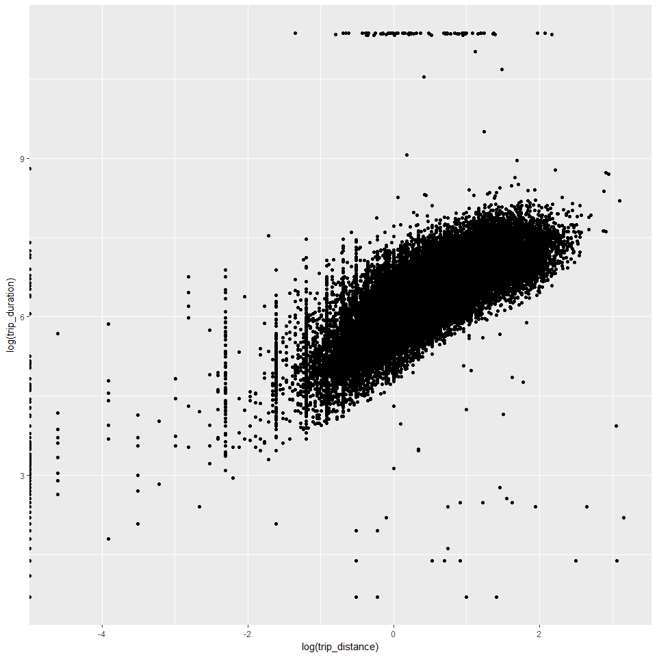
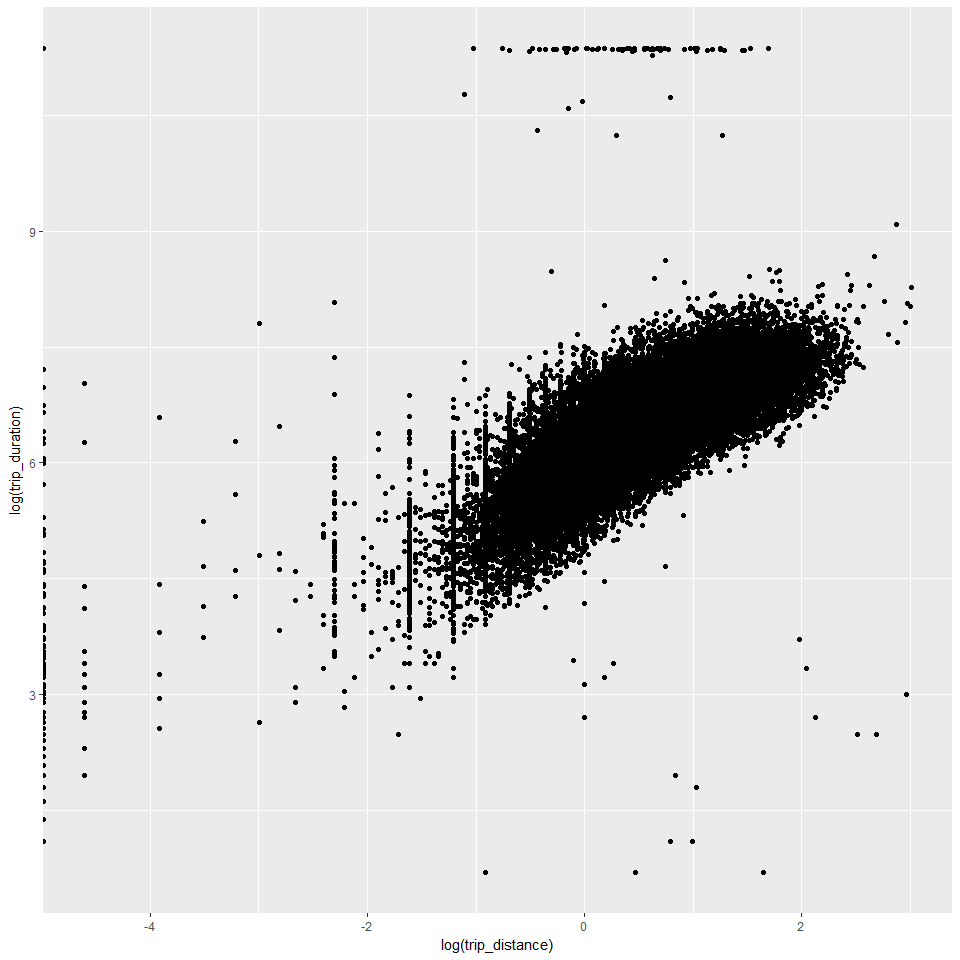
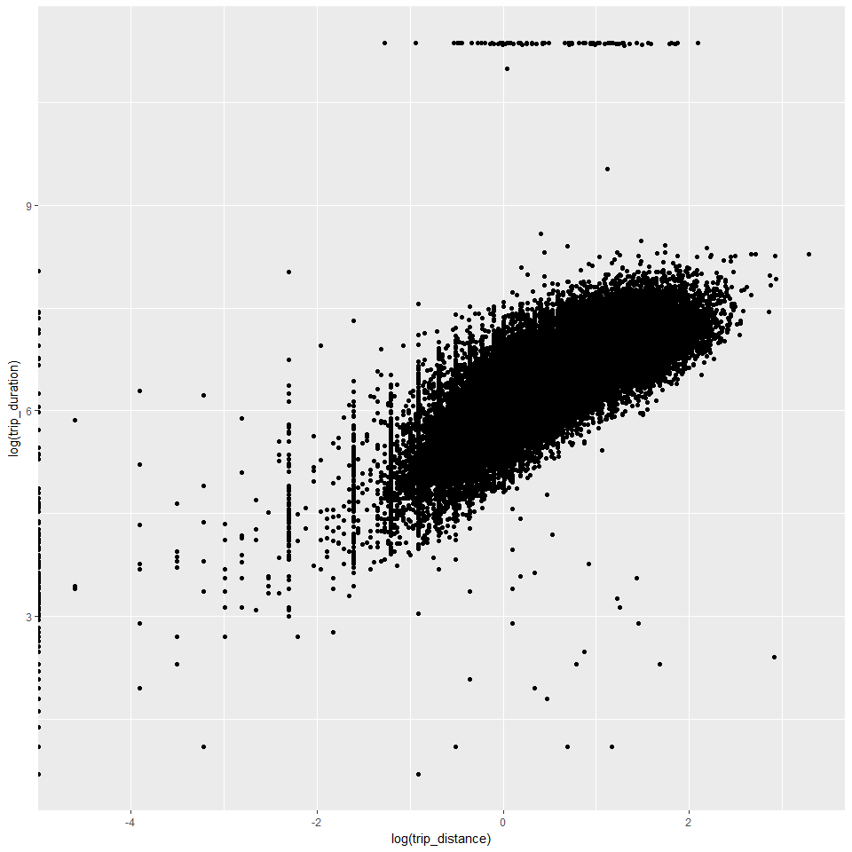
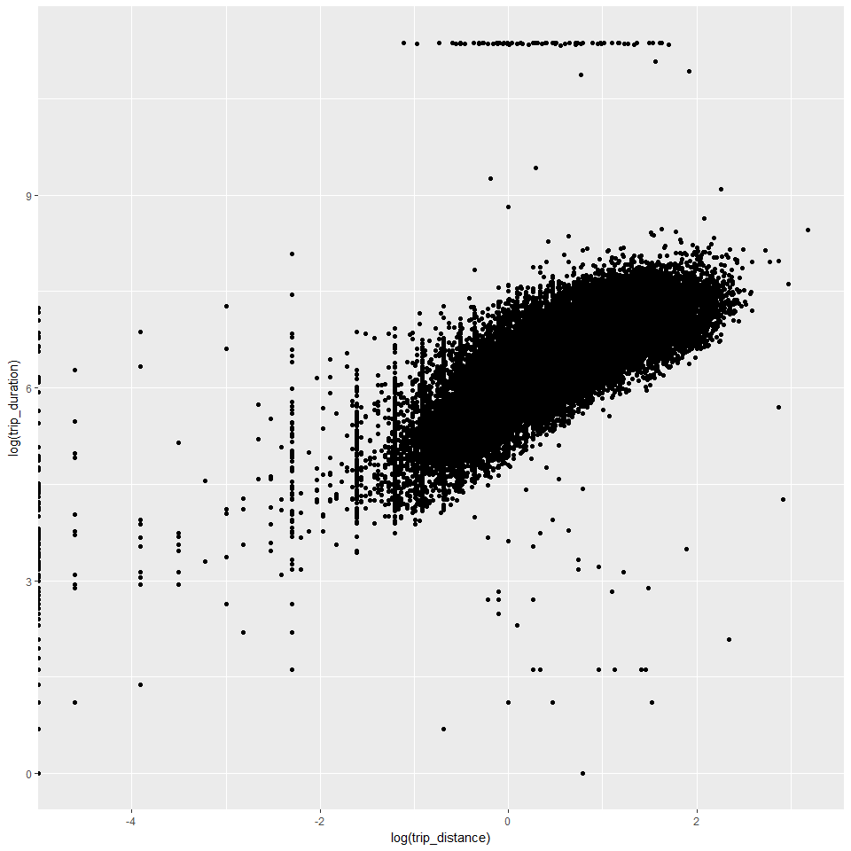

Scaling and deployment
================
Seth Mottaghinejad
2017-02-01

Scaling and deployment
======================

Once a model is built, we're usually interested in using it to make predictions on future data, a process sometimes referred to as **scoring**. This is not very different from how we used the model in the last section to make predictions on the test data using the `rxPredict` function. But future data may be sitting in a different environment from the one used to develop the model.

For example, let's say we want to regularly score new data as it arrives in a SQL Server. Without `RevoScaleR`, we may need to bring the new data out of the SQL Server (e.g. as a flat file or using an ODBC connection) into a machine with R installed. We would then load the data in R to score it and send the scores back to SQL Server. Moving data around is both inefficient and can often breaks security protocols around data governance. Additionally, if the data we are trying to score is too large to fit in the R session, we would also have to perform this process peace-wise using a chunk of the data each time. Microsoft R Server can eliminate all three problems by scoring new data in the machine the data is already sitting in. It uses the efficient `rxPredict` function which can score data without having to load it in an R session in its entirety.

Because `RevoScaleR` comes with parallel modeling and machine learning algorithms, we can also use them to develop models on much larger datasets sitting in SQL Server or on HDFS. This narrows the gap between the development and production environment considerably.

What is WODA?
-------------

In addition to offering scalable algorithms that run on large datasets, Microsoft R Server offers the ability to deploy those algorithms on multiple platforms with minimal changes to the code structure. This is referred to as WODA, which stands for **write once and deploy anywhere**. WODA is an abstraction layer. It allows the data scientist to develop code locally (on a single machine and using smaller datasets) but deploy it in environments such as Hadoop, Spark or SQL Server *without having to change the code too much and without having to know too much about what goes on under the hood in such environments when the code is deployed*.

More information on WODA can be found [here](https://msdn.microsoft.com/en-us/microsoft-r/scaler-distributed-computing).

Setting up the compute context
------------------------------

The way that `RevoScaleR` achieves WODA is by setting and changing the compute context. The **compute context** refers to the environment in which the computation is happening, which by default is set to the machine hosting the **local** R session (called the **client**), but can be change to a **remote** machine (such a a SQL server or a Hadoop/Spark cluster). At a low level, the same computation will run differently in different compute context, but produce the same results. Whenever we need to perform a computation remotely, we simply change the compute context to the remote environment. `RevoScaleR` functions are aware of the compute context at runtime and when the compute context is set to remote they will perform their computation remotely. This is how we can *take the computation to the data* instead of bringing the data to the computation. Other R functions are not compute-context-aware, however as we will see by using the `rxExec` function we can send any arbitrary R function to execute remotely.

Deploying to SQL Server
-----------------------

A basic overview of the SQL Server R Services architecture can be found [here](https://msdn.microsoft.com/en-us/library/mt604885.aspx). Let's point to a SQL table containing a copy of the NYC Taxi dataset. The first thing we need to do is set up a SQL Server *connection string*, which contains our SQL login credentials. Since the connection string contains sensitive information, it is usually stored in a file in a restricted location and read from R, but in our example we will simply hard-code the connection string and store it in `sqlConnString`. Assume, the NYC Taxi dataset is stored in a table called `NYCTaxiSmall` inside the `RDB` database that the connection string points to. The last thing left for us to do is to point to the table, which we do with the `RxSqlServerData` function. This is the equivalent of `RxXdfData` when pointing to an XDF file stored on disk.

``` r
input_xdf <- file.path(data_dir, 'yellow_tripdata_2016_clean.xdf')
nyc_xdf <- RxXdfData(input_xdf)

sqlConnString <- sprintf("Driver=SQL Server;Server=%s;Database=RDB;Uid=ruser;Pwd=ruser", SQLSERVERNAME)
sqlRowsPerRead <- 100000
sqlTable <- "NYCTaxiSmall"

nyc_sql <- RxSqlServerData(connectionString = sqlConnString,
                           rowsPerRead = sqlRowsPerRead, 
                           table = sqlTable)
```

For the sake of illustration, we now dump the content of `nyc_xdf` into the SQL table represented by `nyc_sql` $which in called \`NYCTaxiSmall\` in the SQL database$. If the XDF file in question is large, this can take a while.

``` r
system.time(
  rxDataStep(nyc_xdf, nyc_sql, overwrite = TRUE,
             varsToDrop = c("long_std", "lat_std"))
)
```

    ## Total Rows written: 100000, Total time: 4.059
    ## Total Rows written: 200000, Total time: 8.023
    ## Total Rows written: 300000, Total time: 12.043
    ## Total Rows written: 400000, Total time: 16.046
    ## Total Rows written: 412183, Total time: 16.475
    ## Rows Read: 412183, Total Rows Processed: 412183, Total Chunk Time: 25.427 seconds
    ## Total Rows written: 100000, Total time: 4.082
    ## Total Rows written: 200000, Total time: 8.178
    ## Total Rows written: 300000, Total time: 12.337
    ## Total Rows written: 400000, Total time: 16.522
    ## Total Rows written: 412015, Total time: 16.967
    ## Rows Read: 412015, Total Rows Processed: 824198, Total Chunk Time: 17.439 seconds
    ## Total Rows written: 100000, Total time: 3.906
    ## Total Rows written: 200000, Total time: 7.887
    ## Total Rows written: 300000, Total time: 11.829
    ## Total Rows written: 400000, Total time: 16.015
    ## Total Rows written: 410320, Total time: 16.384
    ## Rows Read: 410320, Total Rows Processed: 1234518, Total Chunk Time: 16.867 seconds
    ## Total Rows written: 100000, Total time: 3.643
    ## Total Rows written: 200000, Total time: 7.293
    ## Total Rows written: 300000, Total time: 11.021
    ## Total Rows written: 400000, Total time: 14.69
    ## Total Rows written: 410440, Total time: 15.025
    ## Rows Read: 410440, Total Rows Processed: 1644958, Total Chunk Time: 15.501 seconds
    ## Total Rows written: 100000, Total time: 3.617
    ## Total Rows written: 200000, Total time: 7.347
    ## Total Rows written: 300000, Total time: 11.311
    ## Total Rows written: 400000, Total time: 14.963
    ## Total Rows written: 414263, Total time: 15.41
    ## Rows Read: 414263, Total Rows Processed: 2059221, Total Chunk Time: 15.883 seconds
    ## Total Rows written: 100000, Total time: 3.594
    ## Total Rows written: 200000, Total time: 7.229
    ## Total Rows written: 300000, Total time: 11.192
    ## Total Rows written: 400000, Total time: 14.886
    ## Total Rows written: 413976, Total time: 15.33
    ## Rows Read: 413976, Total Rows Processed: 2473197, Total Chunk Time: 15.801 seconds
    ## Total Rows written: 100000, Total time: 3.615
    ## Total Rows written: 200000, Total time: 7.283
    ## Total Rows written: 300000, Total time: 10.903
    ## Total Rows written: 400000, Total time: 14.54
    ## Total Rows written: 413956, Total time: 14.98
    ## Rows Read: 413956, Total Rows Processed: 2887153, Total Chunk Time: 15.439 seconds
    ## Total Rows written: 100000, Total time: 3.602
    ## Total Rows written: 200000, Total time: 7.214
    ## Total Rows written: 300000, Total time: 10.917
    ## Total Rows written: 400000, Total time: 14.538
    ## Total Rows written: 414679, Total time: 15.003
    ## Rows Read: 414679, Total Rows Processed: 3301832, Total Chunk Time: 15.460 seconds
    ## Total Rows written: 100000, Total time: 3.627
    ## Total Rows written: 200000, Total time: 7.234
    ## Total Rows written: 300000, Total time: 10.856
    ## Total Rows written: 400000, Total time: 14.52
    ## Total Rows written: 418308, Total time: 15.097
    ## Rows Read: 418308, Total Rows Processed: 3720140, Total Chunk Time: 15.552 seconds
    ## Total Rows written: 100000, Total time: 3.662
    ## Total Rows written: 200000, Total time: 7.375
    ## Total Rows written: 300000, Total time: 11.669
    ## Total Rows written: 400000, Total time: 16.274
    ## Total Rows written: 418648, Total time: 16.868
    ## Rows Read: 418648, Total Rows Processed: 4138788, Total Chunk Time: 17.331 seconds
    ## Total Rows written: 100000, Total time: 3.665
    ## Total Rows written: 200000, Total time: 7.402
    ## Total Rows written: 300000, Total time: 11.116
    ## Total Rows written: 400000, Total time: 14.75
    ## Total Rows written: 415550, Total time: 15.238
    ## Rows Read: 415550, Total Rows Processed: 4554338, Total Chunk Time: 15.697 seconds
    ## Total Rows written: 100000, Total time: 3.749
    ## Total Rows written: 200000, Total time: 7.431
    ## Total Rows written: 300000, Total time: 11.103
    ## Total Rows written: 400000, Total time: 14.72
    ## Total Rows written: 415475, Total time: 15.232
    ## Rows Read: 415475, Total Rows Processed: 4969813, Total Chunk Time: 15.689 seconds

    ##    user  system elapsed 
    ##    0.49    0.00  202.67

That's it. We can now use `nyc_sql` the same way we used `nyc_xdf` before. There is however something missing: we did not specify what the column types were. In this case, `RxSqlServerData` will try as best it can to convert a SQL Server column type to an R column type. This can cause problems though. First of all, SQL Server has a richer variety of column types than R. Second, some SQL Server column types like `datetime` for example don't always successfully transfer to their corresponding R column type. Third, the R column type `factor` does not really have a good equivalent in SQL Server, so in order for a column to be brought in as `factor` we must manually specify it. Doing so however gives us the advantage that we can also specify the levels and labels for it, and as we saw they don't always have to be the exact levels we see in the data. For example, if `payment_type` is represented by the integers 1 through 5 in the data, but we only care about 1 and 2 and want them labeled `card` and `cash` respectively, we can do that here without needing to do it later as a separate transformation. To deal with column types we create an object that stores the information about the columns and pass it to the `colInfo` argument in `RxSqlServerData`. Here's the example for `nyc_sql`:

``` r
rate_levels <- c("standard", "JFK", "Newark", "Nassau or Westchester", "negotiated", "group ride")

ccColInfo <- list(
pickup_datetime    = list(type = "character"),
dropoff_datetime   = list(type = "character"),
passenger_count    = list(type = "integer"),
trip_distance      = list(type = "numeric"),
pickup_longitude   = list(type = "numeric"),
pickup_latitude    = list(type = "numeric"),
dropoff_longitude  = list(type = "numeric"),
dropoff_latitude   = list(type = "numeric"),
rate_code_id       = list(type = "factor", levels = as.character(1:6), newLevels = rate_levels),
store_and_fwd_flag = list(type = "factor", levels = c("Y", "N")),
payment_type       = list(type = "factor", levels = as.character(1:2), newLevels = c("card", "cash")),
fare_amount        = list(type = "numeric"),
tip_amount         = list(type = "numeric"),
total_amount       = list(type = "numeric")
)
```

Notice that the object above does not necessarily have to specify the types for each column in the data. We can limit it only to the columns of interest, and even then only the ones that need to be explicitly overwritten. However, since we tend to be more conservative in a production environment, it's best to be more explicit. After all, certain numeric columns in SQL Server could be stored as something different $\`VARCHAR\` for example$ which would turn into a `character` column in R.

In addition to the columns that were in the original data, we also need to specify the column types for columns that we added to the data throughout the analysis. Let's begin with the date time columns:

``` r
weekday_labels <- c('Sun', 'Mon', 'Tue', 'Wed', 'Thu', 'Fri', 'Sat')
hour_labels <- c('1AM-5AM', '5AM-9AM', '9AM-12PM', '12PM-4PM', '4PM-6PM', '6PM-10PM', '10PM-1AM')

ccColInfo$pickup_dow <- list(type = "factor", levels = weekday_labels)
ccColInfo$pickup_hour <- list(type = "factor", levels = hour_labels)
ccColInfo$dropoff_dow <- list(type = "factor", levels = weekday_labels)
ccColInfo$dropoff_hour <- list(type = "factor", levels = hour_labels)
```

When working with the XDF file in the previous weeks, we went back and forth quite a few times to get the data in the right format, especially where `factor` columns were concerned. This is because we were learning about the data as we went and gradually preparing it for analysis. When working in a production environment however, the assumption is that we have our EDA behind us and know quite a bit about the data already. If not, then a recommended approach would be to take a sample of the data first and run some EDA on it. So some of the steps that we took with the XDF file in the prior weeks may have contained some redundancy or inneficiencies, which we never bothered to go back and revise. But when deploying code in production it's a good idea to make a second pass at the code and simplify things wherever it's warranted. As an example, when working with the XDF file, we first wrote a function to extract the `pickup_nb` and `dropoff_nb` columns from the pick-up and drop-off coordinates. We then noticed that those columns contain neighborhoods outside of Manhattan limits *o**u**r**a**r**e**a**o**f**i**n**t**e**r**e**s**t*, so we made a second pass through the data to remove the factor levels for the irrelevant neighborhoods. With `nyc_sql`, we could take a similar approach: read those columns as `factors` with levels as is, and then use `rxDataStep` to perform a transformation that removes unwanted factor levels. But doing so is inefficient. The better approach is to find all the relevant factor levels *M**a**n**h**a**t**t**a**n**n**e**i**g**h**b**o**r**h**o**o**d**s*, *w**h**i**c**h**w**e**c**a**n**g**e**t**d**i**r**e**c**t**l**y**f**r**o**m**t**h**e**s**h**a**p**e**f**i**l**e* and in the `ccColInfo` object only specify those as levels for those columns. Here's how:

``` r
library(maptools)
nyc_shapefile <- readShapePoly('ZillowNeighborhoods-NY/ZillowNeighborhoods-NY.shp')
library(stringr)
mht_shapefile <- subset(nyc_shapefile, str_detect(CITY, 'New York City-Manhattan'))
manhattan_nhoods <- as.character(mht_shapefile@data$NAME)

ccColInfo$pickup_nb <- list(type = "factor", levels = manhattan_nhoods)
ccColInfo$dropoff_nb <- list(type = "factor", levels = manhattan_nhoods)
```

We are now ready to point to the SQL table a second time, but this time specify how columns should be treated in R using the `colInfo` argument.

``` r
nyc_sql <- RxSqlServerData(connectionString = sqlConnString,
                           table = sqlTable, 
                           rowsPerRead = sqlRowsPerRead, 
                           colInfo = ccColInfo)
```

Just recall that every time we make a change to `ccColInfo`, we need to rerun the above line so that the change is reflected. For example, later $after running the \`seriate\` function$, we can reorder the factor levels so that instead of being alphabetically ordered as they are now, they can follow a more natural ordering based on proximity to each other.

At this point, the rest of the analysis is no different from what it was with the XDF file, so we can change `nyc_xdf` into `nyc_sql` and run the remaining code just like before. For example, we can start with `rxGetInfo` to double check the column types.

``` r
rxGetInfo(nyc_sql, getVarInfo = TRUE, numRows = 3)
```

    ## Connection string: Driver=SQL Server;Server=MININT-1NA9NJM;Database=RDB;Uid=ruser;Pwd=ruser 
    ## Data Source: SQLSERVER 
    ## Number of variables: 23 
    ## Variable information: 
    ## Var 1: pickup_datetime, Type: character
    ## Var 2: dropoff_datetime, Type: character
    ## Var 3: passenger_count, Type: integer
    ## Var 4: trip_distance, Type: numeric
    ## Var 5: pickup_longitude, Type: numeric
    ## Var 6: pickup_latitude, Type: numeric
    ## Var 7: rate_code_id
    ##        6 factor levels: standard JFK Newark Nassau or Westchester negotiated group ride
    ## Var 8: dropoff_longitude, Type: numeric
    ## Var 9: dropoff_latitude, Type: numeric
    ## Var 10: payment_type
    ##        2 factor levels: card cash
    ## Var 11: fare_amount, Type: numeric
    ## Var 12: tip_amount, Type: numeric
    ## Var 13: tolls_amount, Type: numeric
    ## Var 14: tip_percent, Type: numeric
    ## Var 15: pickup_hour
    ##        7 factor levels: 1AM-5AM 5AM-9AM 9AM-12PM 12PM-4PM 4PM-6PM 6PM-10PM 10PM-1AM
    ## Var 16: pickup_dow
    ##        7 factor levels: Sun Mon Tue Wed Thu Fri Sat
    ## Var 17: dropoff_hour
    ##        7 factor levels: 1AM-5AM 5AM-9AM 9AM-12PM 12PM-4PM 4PM-6PM 6PM-10PM 10PM-1AM
    ## Var 18: dropoff_dow
    ##        7 factor levels: Sun Mon Tue Wed Thu Fri Sat
    ## Var 19: trip_duration, Type: integer
    ## Var 20: pickup_nb
    ##        28 factor levels: West Village East Village Battery Park Carnegie Hill Gramercy ... Upper West Side Clinton Yorkville Garment District East Harlem
    ## Var 21: dropoff_nb
    ##        28 factor levels: West Village East Village Battery Park Carnegie Hill Gramercy ... Upper West Side Clinton Yorkville Garment District East Harlem
    ## Var 22: dropoff_cluster, Type: integer
    ## Var 23: split, Type: character
    ## Data (3 rows starting with row 1):
    ##       pickup_datetime    dropoff_datetime passenger_count trip_distance
    ## 1 2016-02-16 20:32:25 2016-02-16 20:40:37               1          1.50
    ## 2 2016-02-12 04:05:34 2016-02-12 04:09:53               6          0.67
    ## 3 2016-02-27 21:19:51 2016-02-27 21:32:49               4          1.40
    ##   pickup_longitude pickup_latitude rate_code_id dropoff_longitude
    ## 1        -73.97365        40.75440         <NA>         -73.98212
    ## 2        -73.98552        40.72697         <NA>         -73.98963
    ## 3        -73.98873        40.75684         <NA>         -73.97889
    ##   dropoff_latitude payment_type fare_amount tip_amount tolls_amount
    ## 1         40.76838         <NA>         7.5       1.75            0
    ## 2         40.73353         <NA>         5.0       0.70            0
    ## 3         40.76354         <NA>         9.5       0.00            0
    ##   tip_percent pickup_hour pickup_dow dropoff_hour dropoff_dow
    ## 1          23    6PM-10PM        Tue     6PM-10PM         Tue
    ## 2          14     1AM-5AM        Fri      1AM-5AM         Fri
    ## 3           0    6PM-10PM        Sat     6PM-10PM         Sat
    ##   trip_duration        pickup_nb        dropoff_nb dropoff_cluster split
    ## 1           492          Midtown   Upper West Side             126  test
    ## 2           259     East Village Greenwich Village             120 train
    ## 3           778 Garment District           Midtown             186 train

Let's now run `rxSummary` on a column of the data:

``` r
system.time(
  rxsum_sql <- rxSummary( ~ fare_amount, nyc_sql, reportProgress = 0)
)
```

    ##    user  system elapsed 
    ##    0.03    0.00   13.64

We get our summary back, but something important is missing. We have not yet set the compute context to the remote SQL Server session. Although we got our summary back, because the compute context was set to the local R session *t**h**e**d**e**f**a**u**l**t* `rxSummary` had to download the data *u**s**i**n**g**a**n**O**D**B**C**c**o**n**n**e**c**t**i**o**n* to the local R session so that it could summarize it. **In-database analytics** however is about taking the data to the computation, not the other way around. So let's now set the compute context to the remote SQL Server session $using \`rxSetComputeContext\`$.

``` r
# Set ComputeContext. Needs a temp directory path to serialize R objects back and forth
sqlShareDir <- paste("C:/AllShare/", Sys.getenv("USERNAME"), sep = "")
sqlWait <- TRUE
sqlConsoleOutput <- FALSE
sqlCC <- RxInSqlServer(connectionString = sqlConnString,
                       shareDir = sqlShareDir, 
                       wait = sqlWait, 
                       consoleOutput = sqlConsoleOutput)
```

And with the compute context now set to SQL Server we now rerun `rxSummary`.

``` r
rxSetComputeContext(sqlCC)
system.time(
  rxsum_sql <- rxSummary( ~ fare_amount, nyc_sql)
)
```

    ##    user  system elapsed 
    ##    0.22    0.03   28.89

We can set the compute context back to local anytime we need to by running `rxSetComputeContext(RxLocalSeq())`. We can also run `rxGetComputeContext()` to see what the current compute context is. The difference in run time between `rxSummary` when the compute context is set to local and when it is set to SQL depends mostly on the size of the data and the speed at which it can travel over the network to reach the local R session *w**h**e**n**t**h**e**c**o**m**p**u**t**e**c**o**n**t**e**x**t**i**s**s**e**t**t**o**l**o**c**a**l*. For large enough data sizes, this difference can be dramatic. By avoiding this cost, in-database analytics means we can greatly reduce our runtime.

There are however some limitations that we need to be aware of. Certain functions, such as `rxMerge`, `rxSort` or `rxSplit` only work with XDF files on the local file system, not with data sitting in Spark or SQL Server. This is because the common data processing functions already have their *p**r**o**b**a**b**l**y**m**o**r**e**e**f**f**i**c**i**e**n**t* implementation, so we can simply defer to the SQL language if we need to join tables, sort tables, or split tables instead of the above-mentioned `RevoScaleR` functions.

As an example, let's run the same linear model we build on the XDF file now using the SQL table. We're going to build the model on 75 percent of the data *t**h**e**t**r**a**i**n**i**n**g**d**a**t**a* by creating a column `u` of random uniform numbers and using `rowSelection` only picking rows where `u < .75`.

``` r
system.time(linmod <- rxLinMod(tip_percent ~ pickup_nb:dropoff_nb + pickup_dow:pickup_hour,
                               data = nyc_sql, reportProgress = 0, 
                               rowSelection = (split == "train")))
```

    ##    user  system elapsed 
    ##    0.60    0.06   62.31

We now point to a new SQL table called `NYCTaxiScore` $our pointer to it in R will be called \`nyc\_score\`$.

``` r
sqlTable <- "NYCTaxiScore"
nyc_score <- RxSqlServerData(connectionString = sqlConnString,
                             rowsPerRead = sqlRowsPerRead, 
                             table = sqlTable)

rxPredict(linmod, data = nyc_sql, outData = nyc_score,
          predVarNames = "tip_percent_pred_linmod", overwrite = TRUE)
```

    ## RxSqlServerData Source
    ## table: NYCTaxiScore
    ## useFastRead: TRUE
    ## trimSpace: TRUE
    ## connectionString: Driver=SQL Server;Server=MININT-1NA9NJM;Database=RDB;Uid=ruser;Pwd=ruser

Alternatively, we can point to the new data by simply copying and modifying `nyc_sql`. This is probably simpler, since the connection string is still the same as before.

``` r
nyc_score <- nyc_sql
nyc_score@table <- "NYCTaxiScore"
```

We now use `rxPredict` to score the `nyc_sql` (the `NYCTaxiSmall` data in SQL) data and output the predictions into `nyc_score` (the `NYCTaxiScore` data in SQL). If any other columns need to also go into the prediction dataset, we can use the `writeModelVars` and `extraVarsToWrite` arguments to `rxPredict` to do that.

``` r
rxPredict(linmod, data = nyc_sql, outData = nyc_score,
          predVarNames = "tip_percent_pred_linmod", overwrite = TRUE, 
          extraVarsToWrite = c("pickup_datetime", "dropoff_datetime"))
```

    ## RxSqlServerData Source
    ## table: NYCTaxiScore
    ## useFastRead: TRUE
    ## trimSpace: TRUE
    ## connectionString: Driver=SQL Server;Server=MININT-1NA9NJM;Database=RDB;Uid=ruser;Pwd=ruser
    ## colInfo: 
    ##    pickup_datetime: 
    ##        type: character
    ##    dropoff_datetime: 
    ##        type: character
    ##    passenger_count: 
    ##        type: integer
    ##    trip_distance: 
    ##        type: numeric
    ##    pickup_longitude: 
    ##        type: numeric
    ##    pickup_latitude: 
    ##        type: numeric
    ##    dropoff_longitude: 
    ##        type: numeric
    ##    dropoff_latitude: 
    ##        type: numeric
    ##    rate_code_id: 
    ##        type: factor
    ##        levels: 1 2 3 4 5 6
    ##        newLevels: standard JFK Newark Nassau or Westchester negotiated group ride
    ##    store_and_fwd_flag: 
    ##        type: factor
    ##        levels: Y N
    ##    payment_type: 
    ##        type: factor
    ##        levels: 1 2
    ##        newLevels: card cash
    ##    fare_amount: 
    ##        type: numeric
    ##    tip_amount: 
    ##        type: numeric
    ##    total_amount: 
    ##        type: numeric
    ##    pickup_dow: 
    ##        type: factor
    ##        levels: Sun Mon Tue Wed Thu Fri Sat
    ##    pickup_hour: 
    ##        type: factor
    ##        levels: 1AM-5AM 5AM-9AM 9AM-12PM 12PM-4PM 4PM-6PM 6PM-10PM 10PM-1AM
    ##    dropoff_dow: 
    ##        type: factor
    ##        levels: Sun Mon Tue Wed Thu Fri Sat
    ##    dropoff_hour: 
    ##        type: factor
    ##        levels: 1AM-5AM 5AM-9AM 9AM-12PM 12PM-4PM 4PM-6PM 6PM-10PM 10PM-1AM
    ##    pickup_nb: 
    ##        type: factor
    ##        levels: West Village East Village Battery Park Carnegie Hill Gramercy Soho Murray Hill Little Italy Central Park Greenwich Village Midtown Morningside Heights Harlem Hamilton Heights Tribeca North Sutton Area Upper East Side Financial District Inwood Chelsea Lower East Side Chinatown Washington Heights Upper West Side Clinton Yorkville Garment District East Harlem
    ##    dropoff_nb: 
    ##        type: factor
    ##        levels: West Village East Village Battery Park Carnegie Hill Gramercy Soho Murray Hill Little Italy Central Park Greenwich Village Midtown Morningside Heights Harlem Hamilton Heights Tribeca North Sutton Area Upper East Side Financial District Inwood Chelsea Lower East Side Chinatown Washington Heights Upper West Side Clinton Yorkville Garment District East Harlem

Since building models can be a tedious and sometimes time-consuming process, we usually save models that we build so that we can use them for subsequent scoring $using \`rxPredict\`$. Saving models is important because we often score new data on a regular basis using the same model. Saving models in R is easy: we simply use the `save` function, but saving models in SQL using the save function may break the rules about saving external objects on the server. Foretunately, there's a way we can save R objects in R *n**o**t**j**u**s**t**m**o**d**e**l**s**b**u**t**i**m**a**g**e**s**o**r**a**n**y**o**t**h**e**r**o**b**j**e**c**t**s* by inserting them into the database. In the following example, we begin by creating a table called models with a single column called model whose type is `varbinary(max)`. Moreover, we create a stored procedure in SQL for inserting a model object into this table.

``` sql
CREATE TABLE models
(model varbinary(max))
GO

CREATE PROCEDURE [dbo].[PersistModel]
@m nvarchar(max)
AS
BEGIN
-- SET NOCOUNT ON added to prevent extra result sets from interfering with SELECT statements.
SET NOCOUNT ON;
insert into models (model) values (convert(varbinary(max),@m,2))
END
```

From R, we can now insert a serialized model object into the above SQL table. To serialize an R object we use the `serialize` function. We then concatenate the serial object into a single *u**s**u**a**l**l**y**l**o**n**g* `character` vector *o**f**l**e**n**g**t**h**o**n**e* which we can insert into the above table. To run any random SQL query in R we can use the `sqlQuery` function as shown here. In this case, the query simply executes the stored procedure to store the model object in the table we created in the last step.

``` r
modelbin <- serialize(linmod, NULL)
modelbinstr <- paste(modelbin, collapse = "")

library(RODBC)
odbcCloseAll()
conn <- odbcDriverConnect(sqlConnString)
q <- paste("EXEC PersistModel @m='", modelbinstr,"'", sep = "")
sqlQuery(conn, q)
```

    ## character(0)

Once the model object is stored in SQL, to open it in R, we must unserialize the object $using the \`unserialize\` R function$. After unserializing it, we obtain the original R object back which can be used to score. So if serializing is the SQL equivalent to the `save` function, unserializing is the equivalent to `load`. We've already seen an example of scoring in dataset using `rxPredict`. Here's an example of doing the same, but by invoking a SQL stored procedure instead of running it directly within R. Before running the stored procedure let's see how we can retrieve the R model object in T-SQL using the `unserialize` function.

``` sql
-- We can run this to show that we can successfully retrieve the model
DECLARE @lmodel2 varbinary(max) = (SELECT TOP 1 model FROM RDB.dbo.models);
EXEC sp_execute_external_script @language = N'R',
@script = N'
            mod <- unserialize(as.raw(model))
            print(summary(mod))',    
@params = N'@model varbinary(max)',
@model = @lmodel2;  
GO
```

If the model object was successfully retrieved, then it can be passed on to the rxPredict function to score any data with. The stored procedure `PredictTipBatchMode` will score the `NYCTaxiSmall` dataset. **When the model in question involves `factor` columns, it's imperative that the columns are converted to factors, and to make sure that the levels match the levels in the data that was used to create the model in the first place.** In this case, the columns `pickup_dow`, `pickup_hour`, `pickup_nb` and `dropoff_nb` all need to be converted form `character` to `factor` before we run the predictions.

``` sql
-- Create prediction stored procedure
CREATE PROCEDURE [dbo].[PredictTipBatchMode] @inquery nvarchar(max)
AS
BEGIN
DECLARE @lmodel2 varbinary(max) = (SELECT TOP 1 model FROM models);
EXEC sp_execute_external_script @language = N'R',
  @script = N'
              weekday_labels <- c("Sun", "Mon", "Tue", "Wed", "Thu", "Fri", "Sat")
              hour_labels <- c("1AM-5AM", "5AM-9AM", "9AM-12PM", "12PM-4PM", "4PM-6PM", "6PM-10PM", "10PM-1AM")

              library(maptools)
              nyc_shapefile <- readShapePoly("C:/Data/NYC_taxi/ZillowNeighborhoods-NY/ZillowNeighborhoods-NY.shp")
              library(stringr)
              mht_shapefile <- subset(nyc_shapefile, str_detect(CITY, "New York City-Manhattan"))
              manhattan_nhoods <- as.character(mht_shapefile@data$NAME)

              mod <- unserialize(as.raw(model))

              InputDataSet <- transform(InputDataSet, 
                  pickup_dow = factor(pickup_dow, levels = weekday_labels),
                  pickup_hour = factor(pickup_hour, levels = hour_labels),
                  pickup_nb = factor(pickup_nb, levels = manhattan_nhoods),
                  dropoff_nb = factor(dropoff_nb, levels = manhattan_nhoods))

              OutputDataSet <- rxPredict(modelObject = mod, data = InputDataSet, 
                                         outData = NULL, predVarNames = "Score", 
                                         type = "response", writeModelVars = FALSE, 
                                         overwrite = TRUE)
              str(OutputDataSet)
              print(OutputDataSet)',
  @input_data_1 = @inquery,
  @params = N'@model varbinary(max)',
  @model = @lmodel2
WITH RESULT SETS ((Score float));
END
```

As a SQL stored procedure, it can be invoked by an application that talks to SQL. Here's how we can run the stored procedure from T-SQL:

``` sql
DECLARE @query_string nvarchar(max)
SET @query_string='SELECT top 100 * FROM NYCTaxiSmall'
EXEC [dbo].[PredictTipBatchMode] @inquery = @query_string;
```

Of course the same stored procedure can be invokes directly by R. Here's how:

``` r
input <- "N' SELECT top 1000 * FROM NYCTaxiSmall'"
q <- paste("EXEC PredictTipBatchMode @inquery = ", input, sep = "")
scoredData <- sqlQuery(conn, q)
head(scoredData)
```

    ##      Score
    ## 1 16.18171
    ## 2 14.55079
    ## 3 11.67182
    ## 4 15.98432
    ## 5 12.90809
    ## 6 13.75910

Let's now look at how visualizations are done in a SQL Server compute context. When creating visualizations in SQL Server we need to consider first if we want to do it in-database or not and second how to store the visualization if it is done in-database. Let's consider several use cases:

If the visualization in question was based on a summary of the data instead of a sample, we could use one of the `RevoScaleR` functions to summarize the data (if the compute context is set to SQL, this happens in-database so there's no need to wrap it in `rxExec`) and then to visualize the summary. Here's an example that involves using `rxQuantile`.

``` r
qt <- data.frame(percentile = seq(1, 99, by = 1))
num_vars <- c('fare_amount', 'tip_percent')
qt[ , num_vars] <- lapply(num_vars, function(var) rxQuantile(var, nyc_sql, probs = qt$percentile / 100))
library(ggplot2)
q1 <- ggplot(aes(x = percentile, y = fare_amount), data = qt) + geom_line()
q2 <- ggplot(aes(x = percentile, y = tip_percent), data = qt) + geom_line()

library(gridExtra)
grid.arrange(q1, q2, ncol = 2)
```


Visualizations that are based on the whole data instead of just a summary of the data might take too long to render (and prehaps be useless) when using very large datasets, so instead we rely on sampling to first get the data to a reasonable size. When performing exploratory data analysis (EDA), which usually involves looking at lots of visualizations, sampling can be very effective. We can sample using `rxDataStep` as we learned before.

``` r
nyc_sample <- rxDataStep(nyc_sql, rowSelection = (u < .01),
                         transforms = list(u = runif(.rxNumRows)))

library(ggplot2)
ggplot(data = nyc_sample, aes(x = log(trip_distance), y = log(trip_duration))) + 
  geom_point()
```



However this is not very efficient becasue we load the whole data into R before we sample it. To be more efficient, we need to sample the data in SQL and only bring the sample into R. This requires is only a little extra work:

``` r
nyc_sample_sql <- nyc_sql
nyc_sample_sql@table <- NULL
nyc_sample_sql@sqlQuery <- 'select * from RDB.dbo.NYCTaxiSmall tablesample (1 percent)'
nyc_sample <- rxImport(nyc_sample_sql)
```

    ## Rows Read: 47961, Total Rows Processed: 47961, Total Chunk Time: 1.138 seconds

``` r
library(ggplot2)
ggplot(data = nyc_sample, aes(x = log(trip_distance), y = log(trip_duration))) + 
  geom_point()
```



In the above scenario, we sampled the data in SQL and then used the `rxImport` function to bring the sample into R (as a `data.frame`, that is) so that we can plot or otherwise use it. Assuming that the sample is not too big, this usually runs rather quickly. However, using `rxImport` does imply that data is still traveling from the SQL VM to our host machine, so it can be plotted and observed. There is however a more clever way to run the above calculation so that no data (big or small) travel occurs and we only receive the plot object back so we can look at it. The problem is that `ggplot` is not a `RevoScaleR` function and therefore it is not compute-context-aware. This means that if we want to run it in-database, we need to explicitly send it to the SQL VM for execution. To do so we can wrap the above code in a function and pass it to the `rxExec` function for remote execution.

``` r
scatterPlot <- function(inDataSource) {
  ds <- rxImport(inDataSource)
  require(ggplot2)
  pl <- ggplot(data = ds, aes(x = log(trip_distance), y = log(trip_duration)))
  pl <- pl + geom_point()
  return(list(myplot = pl))
}

scatterPlot(nyc_sample_sql) # this works, but it's not in-database
```

    ## Rows Read: 49191, Total Rows Processed: 49191, Total Chunk Time: 1.324 seconds

    ## $myplot



For this example to run `ggplot2` needs to be installed on the SQL Server R install. We can launch `Rgui.exe` as an administrator, set the `.libPaths()` to be the location where libraries should go, and then install the package. This should usually be done by an admin, not by individual users.

``` r
rxSetComputeContext(sqlCC)
myplots <- rxExec(scatterPlot, nyc_sample_sql, timesToRun = 1, packagesToLoad = 'ggplot2')
plot(myplots[[1]][["myplot"]]) # only the plot object is returned to us for display
```



Once the plot object is created in-database, it is up to us to decide what to do with it. In some cases, such as the above example, we wanted to look at the plot in our R IDE. In other cases (especially in production), we are more interested in storing plot objects in-database so that they can later be retrieved by other applications and served on dashboards. We now look at an example of how to do that using SSRS. First let's create some plots and store them in the database.

``` sql
USE RDB;
GO
CREATE TABLE plots(plot varbinary(max));
GO

INSERT INTO plots(plot)
EXEC  sp_execute_external_script
   @language = N'R'
  ,@script = N'
        image_file = tempfile()
        jpeg(filename = image_file, width = 500, height = 500)
        hist(data$fare_amount, col = "light blue")
        dev.off()
        outds <- data.frame(data = readBin(file(image_file, "rb"), what = raw(), n = 1e6))'
  ,@input_data_1 = N'select fare_amount from rdb.dbo.NYCTaxiSmall tablesample (1 percent);'
  ,@input_data_1_name = N'data'
  ,@output_data_1_name = N'outds';
```

Once the plot is stored in the database (in a `varbinary` column), it can be picked up by other applications such as SSRS and served.
